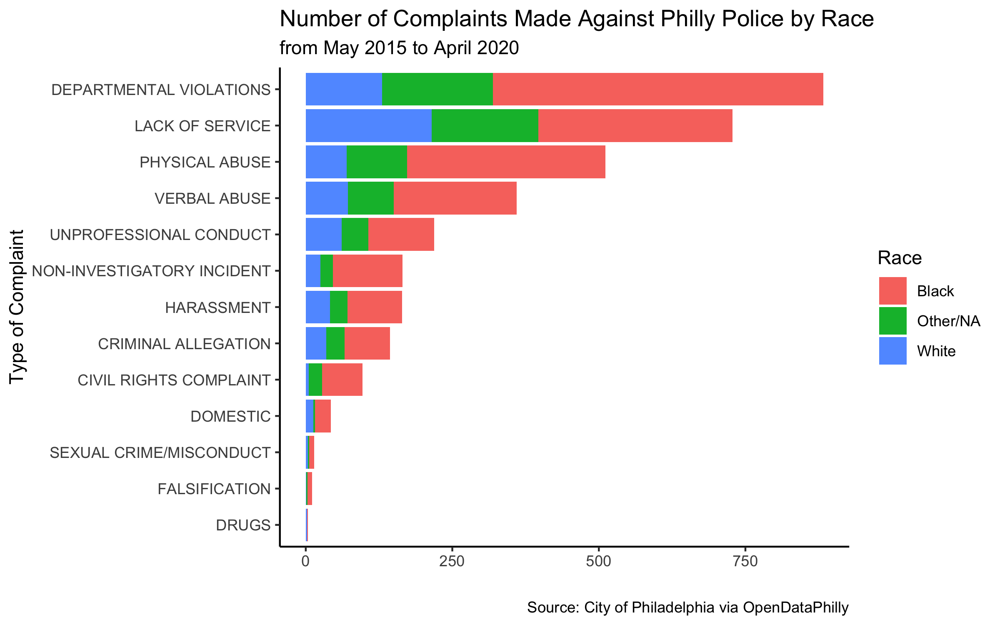

# philly-police-complaints
Project Summary
------
Data and Code used for CAP data story. Data is avaliable online through the City of Philadelphia's [Open Data Portal](https://www.opendataphilly.org/dataset/police-complaints)

<!-- -->

Repo Guide
------
+ /data : latest data from the [Open Data Portal](https://www.opendataphilly.org/dataset/police-complaints) as of June 20, 2020
+ /graphics : graphics made from the data
+ philly_complaints.Rmd : code used for the graphics
